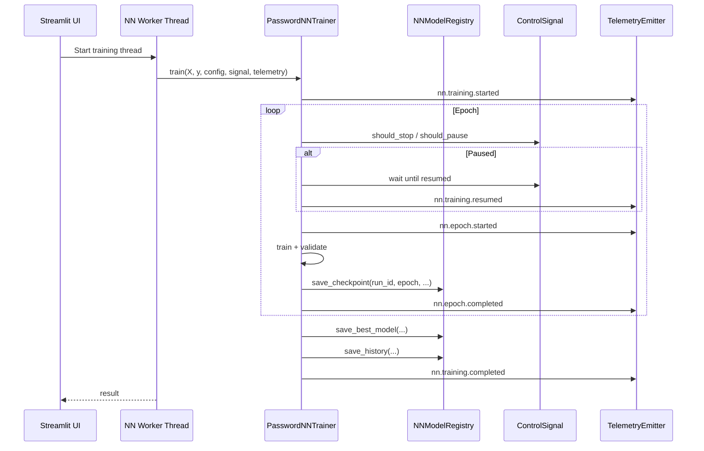

# Neural Network Backend Architecture

Version: 1.0  
Date: 2026-05-08

---

## 1. System Design

### 1.1 Architectural Position

The NN backend is a parallel backend, not a replacement phase for existing adaptive training.

System intent:

- Keep Phase 1 and Phase 2 behavior stable
- Add NN as an independent training track
- Enable side-by-side comparison and optional ensemble

Key property:

- Backward compatible by design

### 1.2 Independent Training Track

NN training has its own:

- Trainer: PasswordNNTrainer
- Artifacts: models/nn/*
- Telemetry namespace: nn.*
- UI entry: Neural Network Training page

This separation reduces coupling and migration risk.

### 1.3 Shared Infrastructure Reuse

NN reuses existing shared components:

- TelemetryEmitter for event buffering and UI updates
- ControlSignal for pause/resume/stop semantics
- Existing Streamlit shell and navigation model

Benefits:

- Minimal duplicated control logic
- Consistent operator experience
- Lower maintenance burden

---

## 2. Model Architecture

### 2.1 Tokenization Layer

Input representation:

- Character-level tokenization
- ASCII vocabulary size: 256
- Max sequence length: 32
- Embedding dimension: 8

Tokenizer output tensor:

- Shape: (batch_size, 32, 8)

### 2.2 CNN Feature Extractor

Core CNN structure:

- Parallel Conv1d branches
- Kernel sizes: 2, 3, 4
- 3 filters per branch
- BatchNorm1d in each branch
- ReLU activation
- MaxPool1d then AdaptiveMaxPool1d(8)

Rationale:

- Multi-scale local pattern extraction
- Compact parameter count
- Stable optimization for local execution

### 2.3 Dense Head

Post-conv flow:

- Branch outputs concatenated and flattened
- Dense projection: 72 -> hidden_dim -> 1
- Dropout between dense layers

Default hidden_dim:

- 64 in PasswordCNN

### 2.4 Binary Classification Objective

Output semantics:

- Model returns logits, shape (B, 1)
- Binary probability via sigmoid(logit)

Loss:

- BCEWithLogitsLoss

Decision threshold:

- Default 0.5 for binary class prediction

### 2.5 Parameter Count

Baseline architecture target:

- ~4,980 parameters

This value is referenced in architecture planning and release communication.

---

## 3. Training Pipeline

### 3.1 Data Split

Default split:

- 80/20 train/validation (val_split=0.2)

Implementation detail:

- Random permutation index split in trainer helper

### 3.2 Optimization Stack

Default optimizer:

- Adam

Default learning rate:

- 0.001

Loss function:

- BCEWithLogitsLoss

### 3.3 Device Selection

GPUManager handles device strategy:

- detect_device: CUDA if available else CPU
- get_batch_size: 128 (CUDA), fallback (CPU default 32)
- get_mixed_precision_context: autocast (CUDA), nullcontext (CPU)

Current runtime behavior:

- Device auto-detection is active
- Trainer currently runs standard FP flow; mixed precision context helper is available for integration

### 3.4 Epoch Loop and State Control

Each epoch cycle:

1. Check stop signal
2. Check pause state and wait for resume
3. Emit epoch start telemetry
4. Train epoch batches
5. Validate epoch
6. Save checkpoint
7. Emit epoch completed telemetry

Stop and pause are cooperative, not preemptive.

### 3.5 Checkpointing and Best Model Selection

During training:

- Per-epoch checkpoint saved to checkpoints/{run_id}/epoch_{epoch}.pt

Best model logic:

- Tracks lowest validation loss
- Stores best model state in memory
- Restores best state before final save

Final persistence:

- best_model.pt
- metadata.json
- metrics.csv

---

## 4. Telemetry Events

### 4.1 Event Namespace

NN telemetry uses event names prefixed with nn.

### 4.2 Implemented Event Flow

Current trainer emits:

- nn.training.started
- nn.epoch.started
- nn.epoch.completed
- nn.training.resumed
- nn.training.stopped
- nn.training.completed

### 4.3 Planned/Design Events

Architecture and telemetry design documents include:

- nn.training.paused

Current code does not emit this as a dedicated event in PasswordNNTrainer. Pause state is still reflected by ControlSignal and UI status handling.

### 4.4 Payload Characteristics

Event payload includes fields such as:

- event_type
- phase (nn_training)
- unit (epoch)
- status
- current/total where relevant
- metrics map with epoch losses and accuracy

---

## 5. Model Registry Structure

Artifact layout for NN backend:

```text
models/nn/
├── checkpoints/{run_id}/
│   ├── epoch_1.pt
│   ├── epoch_2.pt
│   └── ...
├── final/{run_id}/
│   ├── best_model.pt
│   └── metadata.json
└── history/{run_id}/
    └── metrics.csv
```

### 5.1 Checkpoints

Contains:

- model_state
- optimizer_state
- epoch
- metrics

Saved atomically to reduce corruption risk.

### 5.2 Final Model Artifacts

best_model.pt:

- state_dict for final selected model

metadata.json:

- run metadata
- architecture configuration
- training configuration
- summary metrics
- torch version

### 5.3 History Artifacts

metrics.csv:

- epoch-by-epoch metrics for plotting and diagnostics

---

## 6. Ensemble Design

### 6.1 Soft Voting Core

EnsemblePredictor computes average probability over active models:

- Phase 1 model probability
- Phase 2 model probability
- NN probability

All active models receive equal initial weight, then normalized.

### 6.2 Graceful Missing Model Handling

Design behavior:

- Missing or failed model prediction is skipped
- Ensemble still works if at least one model contributes
- Raises error only if no model contributes

This enables incremental operation in partially trained environments.

### 6.3 Thresholded Decisions

Binary label rule:

- predict_proba -> hacked probability column
- prediction = probability >= threshold

Default threshold:

- 0.5

---

## 7. Integration Points

### 7.1 UI Integration

Sidebar includes:

- Neural Network Training page
- Comparison page

NN page responsibilities:

- Configure NN hyperparameters
- Start background training thread
- Render telemetry-driven live progress
- Present final metrics and curves

Comparison page responsibilities:

- Discover latest models from all phases
- Build metric table
- Plot grouped metric bars
- Run ensemble predictions on sample set

### 7.2 Telemetry Integration

NN trainer receives optional TelemetryEmitter and emits lifecycle events consumed by UI.

Data flow:

- Trainer emits event -> emitter buffer -> UI polls events -> widgets refresh

### 7.3 Control Integration

ControlSignal is passed into trainer and checked each epoch.

Control operations:

- request_pause
- resume
- request_stop
- trainer polls should_pause/should_stop

### 7.4 Checkpoint Adapter Pattern

NNModelRegistry abstracts artifact persistence and retrieval.

This keeps training code focused on model lifecycle while preserving a stable storage layout.

---

## 8. Sequence Diagram (Training)



---

## 9. Non-Goals and Constraints

Current non-goals:

- Automated hyperparameter optimization for NN
- Attention-based NN architecture
- Fully integrated early stopping policy

Operational constraints:

- Local resource limits (CPU/RAM/GPU VRAM)
- Dataset quality and balance directly impacts convergence

---

## 10. Reliability and Backward Compatibility

Reliability mechanisms:

- Atomic checkpoint writes
- Best-model restoration before final save
- Control-signal-aware epoch loop
- Explicit telemetry for major transitions

Backward compatibility guarantees:

- Phase 1/2 training paths remain unchanged
- Existing model registries remain valid
- NN backend uses separate artifact namespace

---

## 11. Summary

The NN backend architecture is intentionally compact and composable:

- Small CNN suitable for local workflows
- Clean artifact lifecycle via registry
- Live control and observability through shared infrastructure
- Parallel coexistence with existing Phase 1/2 pipeline

This design enables safe iteration and broad usability while preserving existing system behavior.
